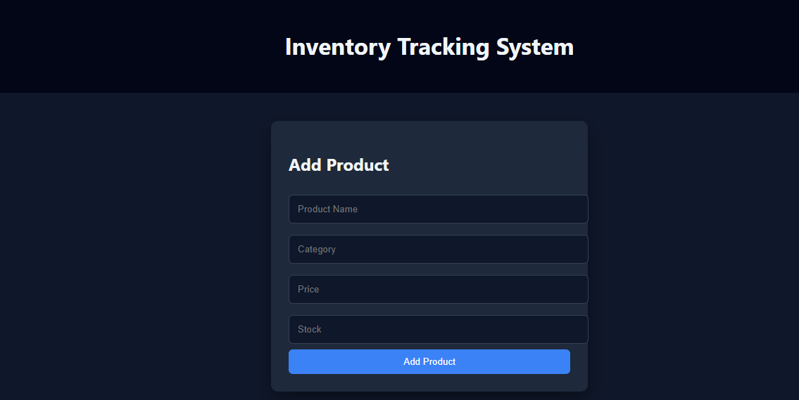
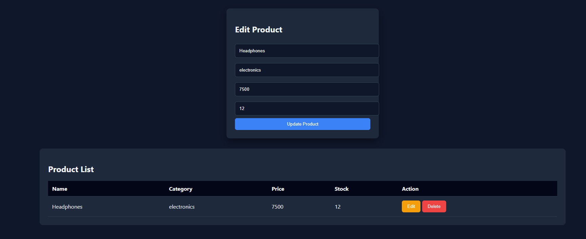
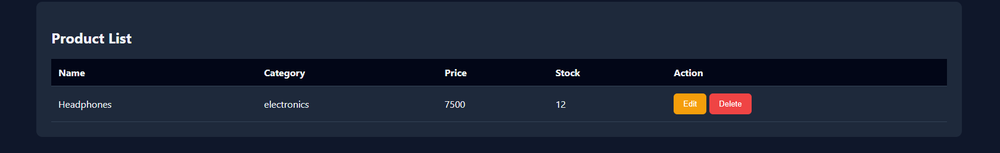

# Inventory Tracking System

A modern **Inventory Tracking System** built using **React, Redux Toolkit, Firebase Realtime Database, and Vite**.
This project allows users to **add, edit, delete, and manage products** in a clean and responsive dashboard interface.

---

## Features

* Add new products to inventory
* Edit existing product details
* Delete products from inventory
* Real-time database integration using Firebase
* Form validation for required fields
* Clean and responsive UI
* Redux Toolkit for state management
* Firebase Realtime Database for backend storage

---

## Tech Stack

Frontend

* React
* Vite
* CSS3

State Management

* Redux Toolkit
* React Redux

Backend / Database

* Firebase Realtime Database

---

## Project Structure

```
inventory-tracking-system
│
├── node_modules
├── public
├── Screenshots
│   ├── Add-product.png
│   ├── Edit.png
│   └── Product-list.png
│
├── src
│   ├── app
│   │   └── store.js
│   │
│   ├── assets
│   │
│   ├── components
│   │   ├── AddProduct.jsx
│   │   ├── Navbar.jsx
│   │   └── ProductList.jsx
│   │
│   ├── features
│   │   └── products
│   │       └── productSlice.js
│   │
│   ├── firebase
│   │   └── firebaseConfig.js
│   │
│   ├── pages
│   │   └── Dashboard.jsx
│   │
│   ├── styles
│   │   └── main.css
│   │
│   ├── App.jsx
│   ├── index.css
│   └── main.jsx
│
├── .gitignore
├── index.html
├── package.json
├── vite.config.js
└── README.md
```

---

## Screenshots

### Add Product



---

### Edit Product



---

### Product List



---

## Installation

Clone the repository

```
https://github.com/Raid-Maniyar/Inventory-Tracking-System
```

Go to project folder

```
cd inventory-tracking-system
```

Install dependencies

```
npm install
```

Run development server

```
npm run dev
```

---

## Firebase Setup

1. Create a project in Firebase
2. Enable **Realtime Database**
3. Copy Firebase configuration
4. Add configuration inside:

```
src/firebase/firebaseConfig.js
```

Example:

```
const firebaseConfig = {
  apiKey: "YOUR_API_KEY",
  authDomain: "YOUR_DOMAIN",
  databaseURL: "YOUR_DATABASE_URL",
  projectId: "YOUR_PROJECT_ID",
  storageBucket: "YOUR_BUCKET",
  messagingSenderId: "YOUR_ID",
  appId: "YOUR_APP_ID"
};
```

---

## Author

Raid Maniyar

Frontend Developer
Learning **React, Redux, and MERN Stack**

---

## License

This project is created for **learning and portfolio purposes**.
